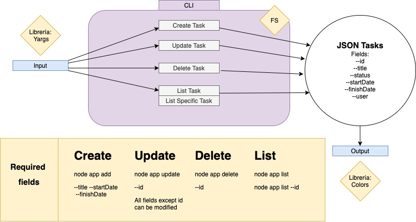

# TODO 

## todo helps you manage you todo tasks

### installation:
    npm install

### usage:

    Start app with << node app.js >>

### commands
------------- 
#### add:

    Add new task

#### update:

    Update task by id

#### delete:

    Delete task by id

#### list:

    List all tasks or list taks by id

### happy path
-----------------------
